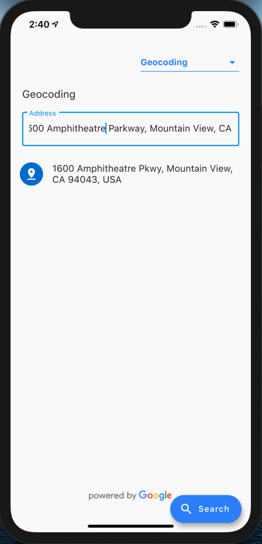
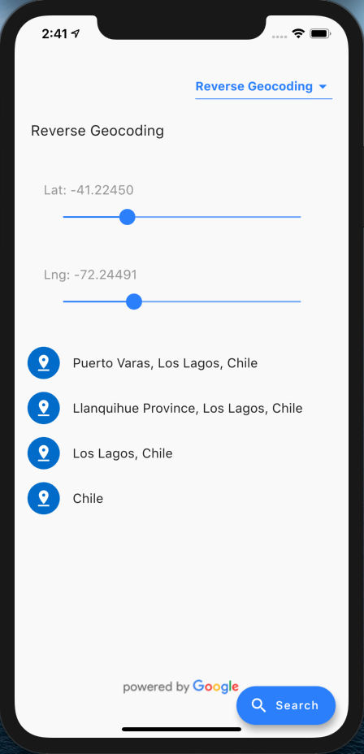
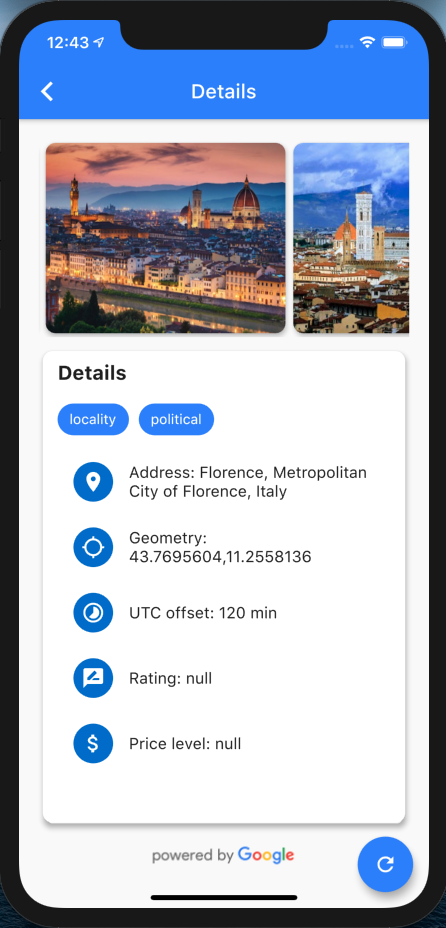

# google_geocoding

## Discontinued

### This project is no longer maintained, and will not receive further updates.


A Flutter plugin that provides a [Google Geocoding API](https://developers.google.com/maps/documentation/geocoding/start).

## Preview

The Geocoding API is a service that provides geocoding and reverse geocoding of addresses.

The following requests are available:

1. [Geocoding](https://developers.google.com/maps/documentation/geocoding/start?hl=en_GB#geocoding-request-and-response-latitudelongitude-lookup) is the process of converting addresses (like a street address) into geographic coordinates (like latitude and longitude), which you can use to place markers on a map, or position the map.
2. [Reverse geocoding](https://developers.google.com/maps/documentation/geocoding/start?hl=en_GB#reverse) is the process of converting geographic coordinates into a human-readable address.

You can also use the Geocoding API to find the address for a given place ID.

## Usage

To use this plugin, add **google_geocoding** as a [dependency in your pubspec.yaml file](https://flutter.dev/docs/development/packages-and-plugins/using-packages).

## Getting Started

- Get an API key at [https://cloud.google.com/maps-platform/](https://cloud.google.com/maps-platform/).
  - Go to Google Developers Console.
  - Choose the project that you want to enable Google Geocoding on.

## Example

- [Example](https://github.com/bazrafkan/google_geocoding/blob/master/example)

  

  

  

## Sample Usage

- Geocoding

```dart
var googleGeocoding = GoogleGeocoding("Your-Key");
var risult = await googleGeocoding.geocoding.get("1600 Amphitheatre",null);
```

- Reverse geocoding

```dart
var googleGeocoding = GoogleGeocoding("Your-Key");
var risult = await googleGeocoding.geocoding.getReverse(LatLon(40.714224,-73.961452));
```
